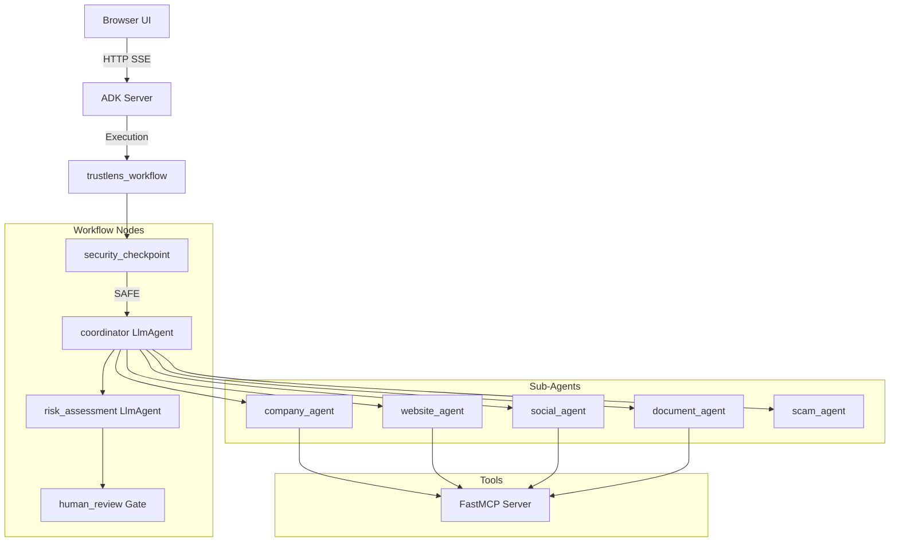
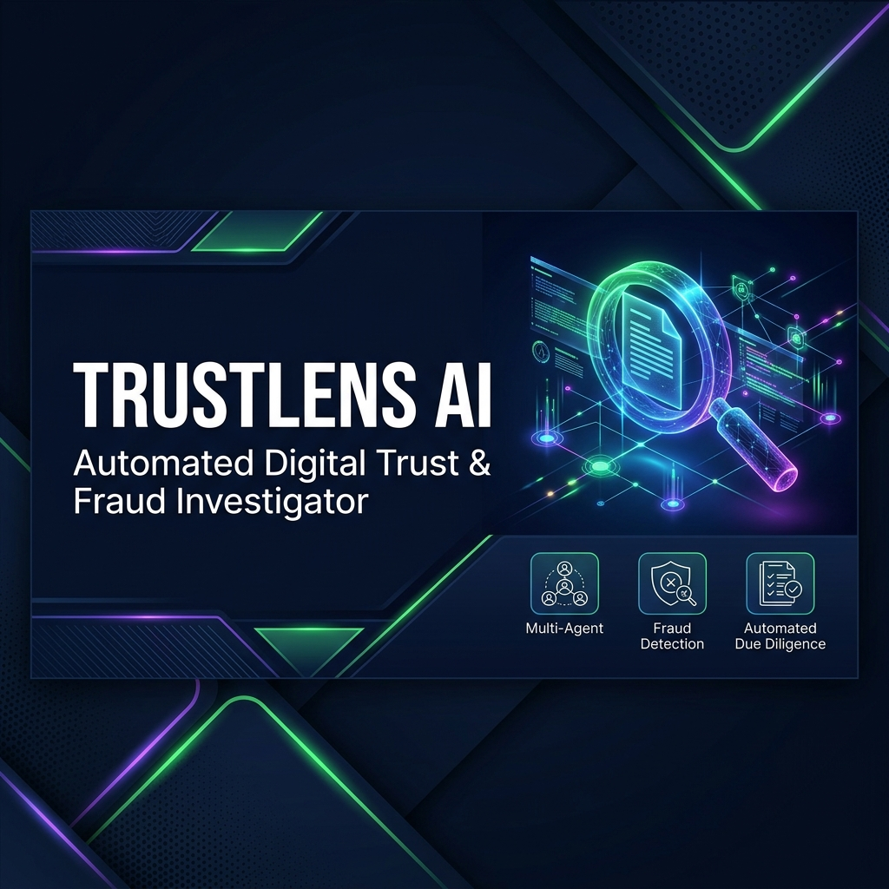
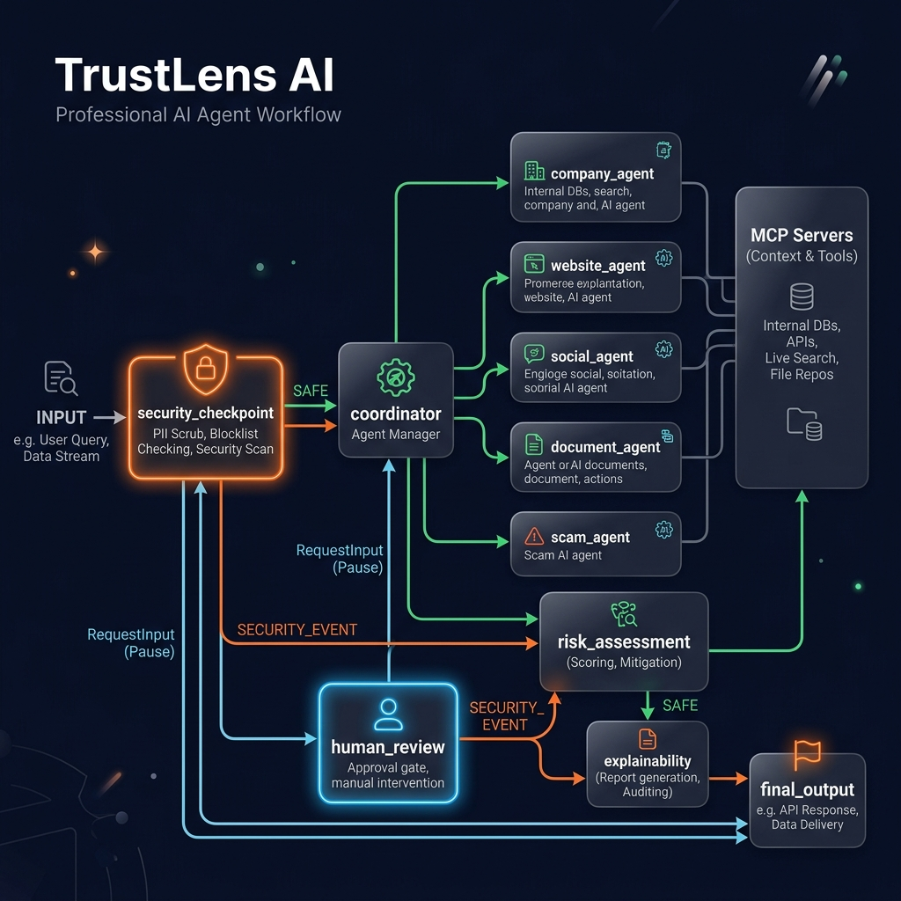

# TrustLens AI

**An intelligent multi-agent platform for automated digital trust and fraud investigation.**

---

## Prerequisites

Before getting started, ensure you have the following installed:
- **Python 3.10+**
- **uv** (Extremely fast Python package installer and resolver)
  - Windows: `powershell -c "irm https://astral.sh/uv/install.ps1 | iex"`
  - Mac/Linux: `curl -LsSf https://astral.sh/uv/install.sh | sh`
- **Google Gemini API Key**: [Get one here](https://aistudio.google.com/app/apikey)

## Quick Start

```bash
git clone https://github.com/N-SAI-VENKATA-TEJA/trustlens-ai.git
cd trustlens-ai
cp .env.example .env   # Open .env and add your GOOGLE_API_KEY
make install           # Uses uv to install dependencies
make playground        # Opens the ADK Dev UI at http://localhost:18081
```

## Architecture



## How to Run

- **Interactive UI Test**: `make playground` (Starts server on port 18081, open browser to test)
- **Local Web Server**: `make run` (Starts API server on port 8000)

## Sample Test Cases

### Case 1: Job Offer Verification
- **Input**: "Investigate this offer letter from NovaTech Innovations. They want a ₹5000 security deposit for my laptop. The website is novatech-careers.com."
- **Expected**: Coordinator calls `company_agent` (checks company existence), `website_agent` (checks domain age), and `scam_agent` (flags advance-fee fraud). Risk assessment scores HIGH risk and triggers the `human_review` gate.
- **Check**: Look at the Graph panel to see the sub-agents execute in parallel. The chat UI should pause and ask for your human approval before showing the final report.

### Case 2: PII Redaction & Security
- **Input**: "My social security number is 123-456-7890 and my email is test@example.com. Check if the domain badguy.mil is safe."
- **Expected**: The `security_checkpoint` strips the SSN and email, replacing them with `[REDACTED_SSN]` and `[REDACTED_EMAIL]`. It then detects the `.mil` domain blocklist rule and immediately aborts the workflow.
- **Check**: The Graph panel should instantly trace from `security_checkpoint` straight down the `SECURITY_EVENT` edge to `final_output`. The chat UI should display "TrustLens Investigation Blocked".

### Case 3: Visual Document Analysis
- **Input**: Upload an image of an offer letter and type: "Check the authenticity of this letter."
- **Expected**: The Coordinator acts as the vision model, extracts the text and visual inconsistencies from the image, and passes it to the `document_agent`. The `document_agent` checks for forgery markers using its MCP tools.
- **Check**: Open the Events tab in the Dev UI to see the Coordinator's internal reasoning extracting the text from your image, and the subsequent JSON payload it sends to the `document_agent`.

## Troubleshooting

1. **`429 RESOURCE_EXHAUSTED` Error**
   - *Cause*: The Gemini API free tier limits you to 15 requests per minute. A single multi-agent run uses ~10-15 calls instantly.
   - *Fix*: Wait 60 seconds for the limit to reset, or upgrade to a Pay-As-You-Go API key.
2. **`The term 'make' is not recognized` (Windows)**
   - *Cause*: Windows does not have the `make` utility installed by default.
   - *Fix*: Run the underlying command directly: `uv run adk web app --host 127.0.0.1 --port 18081 --reload_agents`
3. **Graph shows `ERROR` on a node**
   - *Cause*: Sometimes the LLM returns invalid JSON formatting that the parser cannot read.
   - *Fix*: The `evidence_aggregator` should catch most of these and return a fallback evidence item, but if the graph completely crashes, click "New Session" to restart.

## Push to GitHub

*(Note: If you have already run the setup commands with Antigravity, your code is already pushed!)*

1. Create a new repo at https://github.com/new
   - Name: trustlens-ai
   - Visibility: Public or Private
   - Do NOT initialize with README (you already have one)

2. In your terminal, navigate into your project folder:
   ```bash
   cd trustlens-ai
   git init
   git add .
   git commit -m "Initial commit: trustlens-ai ADK agent"
   git branch -M main
   git remote add origin https://github.com/N-SAI-VENKATA-TEJA/trustlens-ai.git
   git push -u origin main
   ```

3. Verify .gitignore includes:
   ```text
   .env          ← your API key — must NEVER be pushed
   .venv/
   ```

## Assets





## Demo Script

A full conversational presentation script for this project is available in [`DEMO_SCRIPT.txt`](DEMO_SCRIPT.txt).
