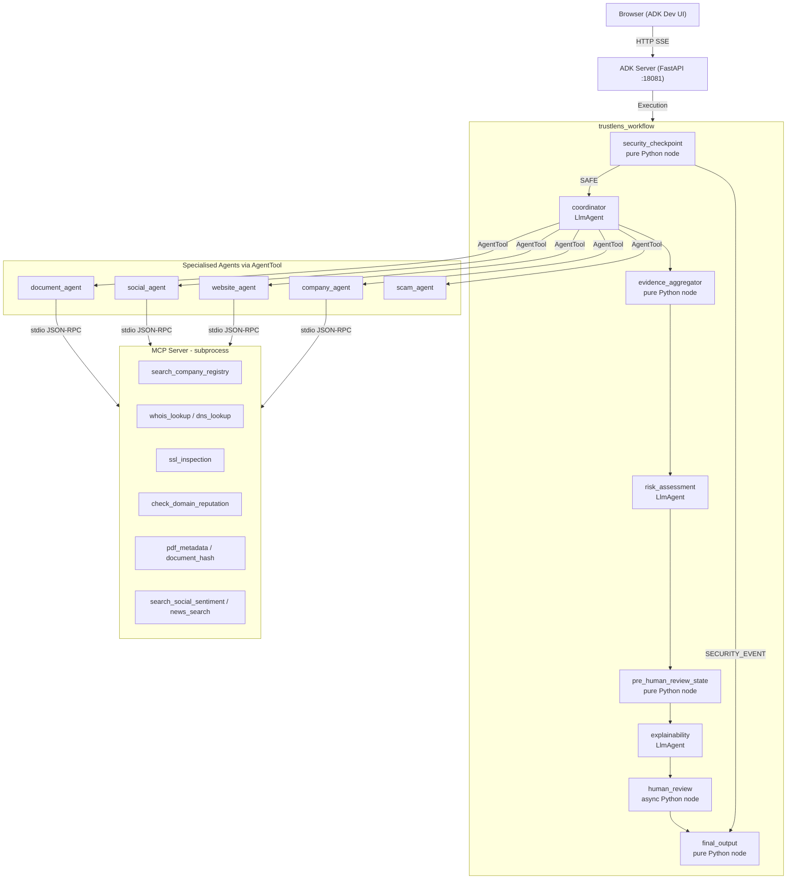

# TrustLens AI

> **An intelligent multi-agent platform for automated digital trust and fraud investigation — powered by Google ADK.**


---

## Table of Contents

1. [Problem Statement](#problem-statement)
2. [Solution](#solution)
3. [Architecture](#architecture)
4. [ADK Concepts Used](#adk-concepts-used)
5. [Security Design](#security-design)
6. [Data Models](#data-models)
7. [Setup & Installation](#setup--installation)
8. [How to Run](#how-to-run)
9. [Sample Test Cases](#sample-test-cases)
10. [Project Structure](#project-structure)
11. [Troubleshooting](#troubleshooting)

---

## Problem Statement

Digital fraud is a growing epidemic. Fake companies, phishing domains, forged offer letters, and advance-fee scams affect millions of job seekers, freelancers, and small businesses every year. Verifying the legitimacy of an entity requires checking multiple disconnected sources simultaneously — corporate registries, WHOIS databases, DNS records, SSL certificates, social sentiment, news archives, and document metadata.

This process is slow, requires specialist knowledge, and is simply too burdensome for the average person. The result is that people fall back on intuition, and sophisticated scammers exploit exactly this gap.

**TrustLens AI** eliminates this barrier. It acts as an always-available, automated digital fraud investigator that performs professional-grade due diligence in seconds — for anyone.

---

## Solution

TrustLens AI is a backend-first Python application built on the **Google Agent Development Kit (ADK)**. It orchestrates a team of **8 specialised AI agents** arranged in a directed workflow graph to investigate an entity from multiple independent angles simultaneously. All findings are synthesised into a structured **Trust Score**, **Risk Score**, **Confidence Score**, and a professional Markdown investigation report.

**Users can provide:**

- Free-text descriptions (company name, job offer text, recruiter details)
- Pasted document content (offer letters, contracts, messages)
- Domain names or URLs to investigate
- Uploaded images of physical documents (offer letters, certificates)

**The system outputs a complete report containing:**

- Executive Summary
- Trust Score (0–100), Risk Score (0–100), Confidence Score (0–100)
- Risk Level: `LOW` / `MEDIUM` / `HIGH` / `CRITICAL`
- Evidence Summary (Positive, Negative, Neutral, Scam Indicators)
- Missing Information and Suggested Next Steps
- Human Review Status and Investigation Timeline

---

## Architecture


### Technology Stack

| Layer              | Component              | Technology                                   |
| ------------------ | ---------------------- | -------------------------------------------- |
| AI Orchestration   | ADK Workflow           | `google.adk.workflow.Workflow`               |
| Agents             | 8 × LlmAgent           | `gemini-2.5-flash` via Gemini API            |
| Tool Server        | MCP Server             | `FastMCP` (subprocess, stdio JSON-RPC)       |
| Session Storage    | SQLite                 | ADK-managed `app/.adk/session.db`            |
| Backend Server     | ADK Web Server         | FastAPI + Uvicorn (`:18081`)                 |
| Production Runtime | Vertex AI Agent Engine | `AdkApp` + `GcsArtifactService`              |
| Telemetry          | OpenTelemetry          | `opentelemetry-instrumentation-google-genai` |
| Package Manager    | uv                     | `pyproject.toml` + `uv.lock`                 |

### Workflow Graph



### End-to-End Request Flow

```
Browser  ──── HTTP POST /run_sse ────►  ADK FastAPI Server (:18081)
                                                    │
                                        ADK Runner (Workflow engine)
                                                    │
                                    security_checkpoint (Python)
                                         │             │
                                      [SAFE]    [SECURITY_EVENT]
                                         │             │
                                    coordinator    final_output
                                    (LlmAgent)
                                         │
                         ┌───────────────┼───────────────┐
                   company_agent   website_agent    scam_agent
                   social_agent   document_agent
                         │
                   MCP Server (stdio subprocess)
                   14 investigation tools
                         │
                   evidence_aggregator (Python)
                         │
                   risk_assessment_agent (LlmAgent)
                         │
                   pre_human_review_state (Python)
                         │
                   explainability_agent (LlmAgent)
                         │
                   human_review (async Python)
                   ── needs_review? ──► RequestInput (pauses UI)
                         │
                   final_output (Python)
                         │
                   SSE stream ──► Browser
```

---

## ADK Concepts Used

### 1. ADK Workflow (`app/agent.py`)

The entire investigation is encoded as a `google.adk.workflow.Workflow` directed graph. Named edge routes (`SAFE`, `SECURITY_EVENT`) enable deterministic conditional branching. The graph mixes synchronous Python `@node` functions and async `LlmAgent` nodes in a single resilient pipeline.

### 2. LlmAgent (`app/agent.py`)

Eight distinct `LlmAgent` instances are deployed, each with a precisely scoped system instruction that enforces domain-specific reasoning. Agents are isolated by role — investigation agents gather evidence, reasoning agents calculate scores, and the explainability agent generates the final report.

| Agent                   | Role                          | Tools                       |
| ----------------------- | ----------------------------- | --------------------------- |
| `coordinator`           | Investigation orchestrator    | AgentTool(×5) + mcp_toolset |
| `company_agent`         | Company registration check    | mcp_toolset                 |
| `website_agent`         | Domain / WHOIS / SSL analysis | mcp_toolset                 |
| `social_agent`          | Public sentiment & news       | mcp_toolset                 |
| `document_agent`        | Document & image forensics    | mcp_toolset                 |
| `scam_agent`            | Fraud pattern detection       | None (reasoning only)       |
| `risk_assessment_agent` | Quantitative risk scoring     | None (reasoning only)       |
| `explainability_agent`  | Markdown report generation    | None (reasoning only)       |

### 3. AgentTool (`app/agent.py`)

The `coordinator` uses `AgentTool` to call each specialised sub-agent as a tool, creating a true hierarchical multi-agent architecture. The coordinator decides at runtime which combination of agents is relevant to the user's input.

### 4. MCP Server (`app/mcp_server.py`)

A `FastMCP` tool server runs as a subprocess, connected via stdin/stdout JSON-RPC. It exposes **14 investigation tools** across four categories, keeping tool execution completely isolated from agent reasoning.

| Category | Tools                                                                                                           |
| -------- | --------------------------------------------------------------------------------------------------------------- |
| Company  | `search_company_registry`                                                                                       |
| Website  | `whois_lookup`, `dns_lookup`, `ssl_inspection`, `website_metadata`, `check_domain_reputation`, `url_reputation` |
| Document | `pdf_metadata`, `document_hash`, `qr_decoder`                                                                   |
| Social   | `search_social_sentiment`, `news_search`, `review_search`, `virus_scan`                                         |

### 5. Pure Python `@node` Functions

`security_checkpoint`, `evidence_aggregator`, `pre_human_review_state`, and `final_output` are deterministic Python nodes — deliberately avoiding LLM non-determinism for security gating, JSON parsing, and report assembly.

### 6. Async Human-in-the-Loop (`human_review`)

An async generator node that `yield`s a `RequestInput` event to **physically pause the workflow** when `needs_review` is `true`. The ADK Dev UI surfaces a prompt to the user. On reply, the workflow resumes via `ctx.resume_inputs`.

### 7. Session State (`ctx.state`)

ADK's `ctx.state` dictionary (backed by SQLite) serves as the shared memory layer across all nodes — storing evidence lists, risk assessment JSON, the report draft, human approval status, and the investigation timeline.

### 8. ADK Dev UI & Agents CLI

`make playground` launches the ADK Dev UI with a real-time graph visualisation panel, Events tab streaming every intermediate agent output, and an OpenTelemetry Trace tab — used extensively during development.

---

## Security Design

The `security_checkpoint` node implements a **zero-trust gateway** that runs before any LLM is called:

1. **Prompt Injection Detection** — Scans for manipulation keywords (`"ignore previous"`, `"bypass"`, `"override"`, `"you are now"`). Immediately routes to `SECURITY_EVENT` if found.
2. **Domain Blocklisting** — Blocks `.mil` and `.gov` domains to prevent reconnaissance against government/military infrastructure.
3. **PII Scrubbing** — Five regex patterns redact sensitive identifiers before they reach the Gemini API:

   | Pattern                   | Replacement          |
   | ------------------------- | -------------------- |
   | Credit card numbers       | `[REDACTED_CC]`      |
   | Social Security Numbers   | `[REDACTED_SSN]`     |
   | Email addresses           | `[REDACTED_EMAIL]`   |
   | Phone numbers             | `[REDACTED_PHONE]`   |
   | API keys in query strings | `[REDACTED_API_KEY]` |

4. **Multimodal Preservation** — If the input contains an uploaded image, only the text part is scrubbed; the image is preserved in-place for the coordinator's vision analysis.

---

## Data Models

All inter-agent data exchange uses typed **Pydantic models** defined in `app/models.py`:

| Model                | Purpose                                                                                                                                                                          |
| -------------------- | -------------------------------------------------------------------------------------------------------------------------------------------------------------------------------- |
| `EvidenceItem`       | Atomic unit of evidence produced by each investigation agent. Fields: `source_agent`, `category`, `description`, `confidence`, `severity`, `verification_status`, `risk_impact`. |
| `RiskAssessment`     | Structured output of `risk_assessment_agent`. Fields: `trust_score`, `risk_score`, `confidence_score` (0–100), `risk_level`, `recommendation`, `uncertainties`, `needs_review`.  |
| `SecurityEvent`      | Produced by `security_checkpoint` on violations. Carries `violation_reason` shown to the user.                                                                                   |
| `InvestigationState` | String enum labelling each stage in the `timeline` audit trail.                                                                                                                  |

---

## Setup & Installation

### Prerequisites

- **Python 3.11+**
- **uv** package manager
  - Windows: `powershell -c "irm https://astral.sh/uv/install.ps1 | iex"`
  - Mac/Linux: `curl -LsSf https://astral.sh/uv/install.sh | sh`
- **Google Gemini API Key** — [Get one free at Google AI Studio](https://aistudio.google.com/app/apikey)

### Step-by-Step Setup

**1. Clone the repository**

```bash
git clone https://github.com/N-SAI-VENKATA-TEJA/trustlens-ai.git
cd trustlens-ai
```

**2. Configure your API key**

```bash
cp .env.example .env
```

Open `.env` and set your key:

```env
GOOGLE_API_KEY=your_gemini_api_key_here
GOOGLE_GENAI_USE_VERTEXAI=False
GEMINI_MODEL=gemini-2.5-flash
```

**3. Install dependencies**

```bash
make install
# or without make:
uv sync
```

**4. Launch the application**

```bash
make playground
# or without make (Windows):
uv run adk web app --host 127.0.0.1 --port 18081 --reload_agents
```

**5. Open the Dev UI**

Navigate to [http://127.0.0.1:18081](http://127.0.0.1:18081) in your browser. Select the `app` application from the dropdown to start an investigation session.

---

## How to Run

| Command           | Description                                                      |
| ----------------- | ---------------------------------------------------------------- |
| `make install`    | Install all dependencies via `uv sync`                           |
| `make playground` | Start the ADK Dev UI on port **18081** (recommended for testing) |
| `make run`        | Start the API server on port **8000**                            |
| `make test`       | Run the test suite via `pytest`                                  |

> **Windows users without `make`:** Run `uv run adk web app --host 127.0.0.1 --port 18081 --reload_agents` directly.

---

## Sample Test Cases

### Case 1: Job Offer Fraud Detection

**Input:**

```
Investigate this offer letter from NovaTech Innovations. They want a ₹5000 security deposit for my laptop before joining. The website is novatech-careers.com.
```

**What happens:**

- `coordinator` identifies the company name, domain, and suspicious payment request
- Routes to `company_agent` (finds no registry match), `website_agent` (detects brand-new domain), and `scam_agent` (flags advance-fee language)
- `risk_assessment_agent` scores `CRITICAL` risk with `needs_review: true`
- Workflow **pauses** — the Dev UI prompts you: _"Investigation requires human review... Do you approve?"_
- After approval, the full investigation report is delivered

**Dev UI check:** Watch the Graph panel highlight each node in sequence. Open the Events tab to see each agent's raw JSON evidence in real time.

---

### Case 2: PII Redaction & Security Block

**Input:**

```
My social security number is 123-456-7890 and my email is test@example.com. Check if the domain badguy.mil is safe.
```

**What happens:**

- `security_checkpoint` redacts SSN → `[REDACTED_SSN]` and email → `[REDACTED_EMAIL]`
- Detects `.mil` domain → immediately routes `SECURITY_EVENT` to `final_output`
- No LLM is ever called

**Dev UI check:** The Graph panel traces directly from `security_checkpoint` to `final_output`, skipping all other nodes. The chat UI displays _"TrustLens Investigation Blocked"_.

---

### Case 3: Visual Document Analysis

**Input:** Upload an image of a physical offer letter, then type:

```
Check the authenticity of this letter.
```

**What happens:**

- `security_checkpoint` preserves the image in the multimodal payload
- `coordinator` acts as the vision model — extracts text, company name, visual inconsistencies, and suspicious elements from the image
- Routes to `document_agent` and `scam_agent` with the extracted content as structured text
- `document_agent` calls `pdf_metadata`, `document_hash`, and `qr_decoder` via MCP

**Dev UI check:** Open the Events tab to see the Coordinator's internal reasoning as it interprets the image before invoking sub-agents.

---

## Project Structure

```
trustlens-ai/
├── app/                          # All agent logic lives here
│   ├── __init__.py               # Exports the ADK `app` object
│   ├── agent.py                  # All agents, nodes, and the workflow graph
│   ├── agent_runtime_app.py      # Production wrapper for Vertex AI Agent Engine
│   ├── config.py                 # Central configuration (model, flags)
│   ├── mcp_server.py             # FastMCP tool server (14 investigation tools)
│   ├── models.py                 # Pydantic data models (EvidenceItem, RiskAssessment…)
│   └── app_utils/
│       ├── telemetry.py          # OpenTelemetry setup for production logging
│       └── typing.py             # Feedback Pydantic model
├── deployment/
│   └── terraform/                # GCP infrastructure-as-code for Vertex AI Agent Engine
├── tests/
│   ├── eval/                     # Evaluation datasets
│   ├── integration/              # Integration tests
│   └── unit/                     # Unit tests
├── assets/                       # Images used in this README
├── .env.example                  # Environment variable template
├── agents-cli-manifest.yaml      # agents-cli project manifest
├── Makefile                      # Developer shortcut commands
├── pyproject.toml                # Dependencies and project config
└── SUBMISSION_WRITEUP.md         # Detailed technical submission write-up
```

---

## Troubleshooting

| Error                                | Cause                                                                                      | Fix                                                                                                                                   |
| ------------------------------------ | ------------------------------------------------------------------------------------------ | ------------------------------------------------------------------------------------------------------------------------------------- |
| `429 RESOURCE_EXHAUSTED`             | Free Gemini API tier is limited to 15 requests/min. One multi-agent run uses ~10–15 calls. | Wait 60 seconds or upgrade to a Pay-As-You-Go API key.                                                                                |
| `'make' is not recognized` (Windows) | Windows lacks the `make` utility by default.                                               | Run: `uv run adk web app --host 127.0.0.1 --port 18081 --reload_agents`                                                               |
| Graph shows `ERROR` on a node        | The LLM occasionally returns malformed JSON.                                               | The `evidence_aggregator` catches most errors with a fallback item. Click **New Session** to restart if the graph crashes completely. |
| `ModuleNotFoundError: app`           | Running from the wrong directory.                                                          | Always run commands from the project root (`trustlens-ai/`).                                                                          |
