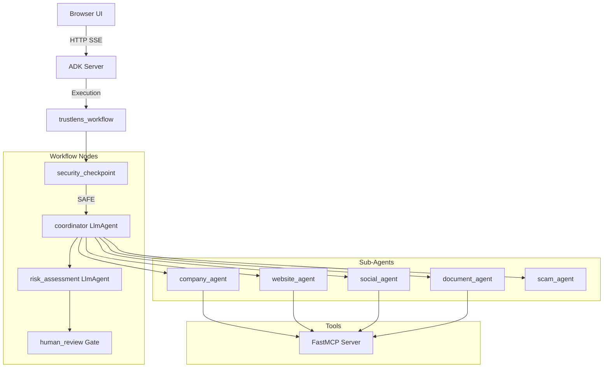

# TrustLens AI — Submission Write-Up

## Problem Statement
Digital fraud, fake companies, phishing domains, and forged documents affect individuals and businesses daily. When users receive suspicious job offers, freelance contracts, or vendor proposals, verifying their authenticity requires manually checking multiple disjointed sources (company registries, WHOIS databases, social media, document metadata). Because this is time-consuming and requires specialized expertise, users often rely on intuition, making them vulnerable to sophisticated scams.

## Solution Architecture
TrustLens AI solves this by acting as an automated digital fraud investigator. Using a Multi-Agent architecture powered by the Google Agent Development Kit (ADK), it orchestrates a team of specialized AI agents that independently investigate companies, websites, social reputation, and documents, synthesizing all evidence into a single, structured Trust Score and risk report.

## Concepts Used

- **ADK Workflow (`app/agent.py`)**: The entire investigation is structured as a directed graph. The `Workflow` class ties together synchronous Python nodes and async LLM Agents into a resilient pipeline.
- **LlmAgent (`app/agent.py`)**: We deployed 7 distinct `LlmAgent` instances, each with highly specialized system instructions (e.g., `company_agent`, `scam_agent`, `risk_assessment_agent`), preventing hallucinations and enforcing domain-specific reasoning.
- **AgentTool (`app/agent.py`)**: The `coordinator` LLM Agent uses `AgentTool` to dynamically call the specialized sub-agents based on the user's input, creating a true hierarchical agent architecture.
- **MCP Server (`app/mcp_server.py`)**: We implemented 14 specific fraud-investigation tools (like `whois_lookup` and `pdf_metadata`) using the Model Context Protocol (FastMCP), running as a subprocess to keep tool execution isolated from agent reasoning.
- **Security Checkpoint (`app/agent.py`)**: A synchronous Python `@node` running before the LLMs to sanitize inputs and block malicious injections.
- **Agents CLI**: Used extensively (`make playground` / `uv run adk web app`) to iterate and visualize the execution graph in real-time.

## Security Design
The `security_checkpoint` node acts as a zero-trust gateway:
- **Prompt Injection Defense**: Scans for keywords like "ignore previous" to prevent attackers from manipulating the investigation logic.
- **PII Scrubbing**: Uses Regex to redact SSNs, Credit Cards, Phone Numbers, and Emails before they reach the Gemini API, protecting user privacy.
- **Domain Blocklisting**: Hard-blocks `.gov` and `.mil` domains from being investigated to prevent accidental reconnaissance against government infrastructure.

## MCP Server Design
The `mcp_server.py` exposes 14 tools categorized by domain:
- **Company Tools** (`search_company_registry`): Verifies corporate existence.
- **Website Tools** (`whois_lookup`, `ssl_inspection`, `dns_lookup`, `url_reputation`): Detects newly registered domains or invalid SSLs common in phishing.
- **Social Tools** (`search_social_sentiment`, `news_search`): Finds public complaints.
- **Document Tools** (`pdf_metadata`, `document_hash`): Extracts hidden creation dates and checks for known forged file hashes.

## Human-in-the-Loop (HITL) Flow
The `human_review` node in `app/agent.py` acts as an automated safety gate. After the `risk_assessment_agent` calculates the scores, if it detects `CRITICAL` risk or has a `confidence_score` below 70, it sets a `needs_review` flag. The async Python node yields a `RequestInput` event, physically pausing the workflow and popping up a chat box in the UI asking the user: *"Investigation requires human review... Do you approve?"* If the user approves, the workflow resumes and delivers the final report.

## Demo Walkthrough
1. **Job Offer Verification**: A user uploads an image of an offer letter from "NovaTech Innovations" asking for a ₹5000 deposit. The `coordinator` extracts the text, routes it to the `company_agent` (finds no registry), `website_agent` (finds the domain is 2 days old), and `scam_agent` (flags advance-fee fraud). The `risk_assessment_agent` scores it HIGH risk, triggering the `human_review` gate.
2. **Security Block**: A user pastes a `.mil` URL and an SSN. The `security_checkpoint` instantly aborts the workflow and returns a block message.

## Impact / Value Statement
TrustLens AI democratizes professional due diligence. By combining multi-agent reasoning with deterministic data fetching, it reduces a manual 30-minute investigation across dozens of websites down to a 15-second automated check. This empowers everyday consumers, job seekers, and freelancers to make safer digital decisions and protect themselves from increasingly sophisticated online fraud.
